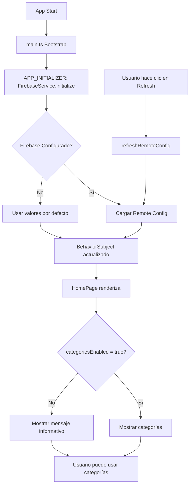

# 🎉 Integración Completa de Firebase y Remote Config

## Resumen de Cambios

He completado exitosamente la integración de Firebase y Remote Config con feature flags en tu aplicación `pruebaEntrevista`. Aquí están todos los cambios implementados:

## ✅ Cambios Implementados

### 1. **FirebaseService** (`src/app/services/firebase.service.ts`)
- ✅ Servicio completo para inicializar Firebase
- ✅ Configuración de Remote Config con valores por defecto
- ✅ Métodos para obtener feature flags
- ✅ Refresh manual de configuración desde Firebase
- ✅ Control de inicialización con bandera `initialized`
- ✅ Manejo robusto de errores con fallback a valores por defecto

**Feature Flags disponibles:**
- `categoriesEnabled`: Habilita/deshabilita la funcionalidad de categorías
- `maxTodosPerUser`: Número máximo de tareas por usuario
- `enableNotifications`: Activa/desactiva notificaciones
- `maintenanceMode`: Modo de mantenimiento

### 2. **FeatureFlagsComponent** (`src/app/components/feature-flags/feature-flags.component.ts`)
- ✅ Componente standalone que muestra el estado de todos los flags
- ✅ Indicadores visuales (badges verdes, rojos, amarillos)
- ✅ Botón para refrescar flags manualmente desde Firebase
- ✅ Muestra la hora de última actualización
- ✅ Descripción de cada flag para claridad

### 3. **Actualización de main.ts**
- ✅ Importación de `FirebaseService`
- ✅ Función `initializeFirebase` en `APP_INITIALIZER`
- ✅ Inicialización de Firebase ANTES de renderizar la página
- ✅ Inicialización sincrónica con `CategoryService`

### 4. **HomePage Integración** (`src/app/pages/home/home.page.ts`)
- ✅ Inyección de `FirebaseService`
- ✅ Monitoreo de feature flag `categoriesEnabled`
- ✅ Propiedad `categoriesEnabled` que se actualiza reactivamente
- ✅ Espera de inicialización de Firebase en `initializePage()`
- ✅ Importación de `FeatureFlagsComponent`

### 5. **HomePage Template** (`src/app/pages/home/home.page.html`)
- ✅ Renderizado condicional de categorías basado en flag
- ✅ Mensaje informativo cuando categorías están deshabilitadas
- ✅ Componente `<app-feature-flags>` para mostrar el estado
- ✅ Posición estratégica de feature flags después de estadísticas

### 6. **Documentación** (`FIREBASE_SETUP.md`)
- ✅ Guía completa de configuración paso a paso
- ✅ Instrucciones para crear proyecto Firebase
- ✅ Cómo obtener credenciales
- ✅ Configuración de Remote Config en Firebase Console
- ✅ Pasos para probar feature flags
- ✅ Solución de problemas (troubleshooting)
- ✅ Información de seguridad

## 🚀 Cómo Usar

### Paso 1: Obtener Credenciales de Firebase
1. Ve a https://console.firebase.google.com
2. Crea un nuevo proyecto o usa uno existente
3. Registra tu aplicación web
4. Copia las credenciales

### Paso 2: Configurar en la Aplicación
1. Abre `src/app/services/firebase.service.ts`
2. Reemplaza los valores en el objeto `firebaseConfig`:
   ```typescript
   private firebaseConfig = {
     apiKey: 'YOUR_API_KEY_HERE',
     authDomain: 'YOUR_PROJECT.firebaseapp.com',
     projectId: 'YOUR_PROJECT_ID_HERE',
     // ... resto de valores
   };
   ```

### Paso 3: Configurar Remote Config en Firebase Console
1. En Firebase Console → Build → Remote Config
2. Crea los parámetros con los nombres exactos:
   - `categoriesEnabled` (boolean) = true
   - `maxTodosPerUser` (number) = 100
   - `enableNotifications` (boolean) = true
   - `maintenanceMode` (boolean) = false
3. Publica la configuración

### Paso 4: Probar
1. Inicia el servidor: `ionic serve`
2. La sección "Feature Flags" aparecerá automáticamente
3. El flag `categoriesEnabled` controla si se muestran las categorías
4. Haz clic en "Refrescar desde Firebase" para actualizar

## 🔄 Cómo Funciona



## 📊 Estado de Feature Flags en la UI

La sección de Feature Flags muestra:

```
🚩 Feature Flags
├─ Categorías Habilitadas
│  └─ ✓ Activo / ✗ Inactivo
├─ Notificaciones Habilitadas
│  └─ ✓ Activo / ✗ Inactivo
├─ Modo de Mantenimiento
│  └─ ⚠ Activo / ○ Inactivo
├─ Máximo de Tareas por Usuario
│  └─ 📊 100
└─ 🔄 Refrescar desde Firebase
   └─ Última actualización: HH:mm:ss
```

## 🔐 Puntos Importantes de Seguridad

1. **NO hagas commit de credenciales de Firebase**
2. Las credenciales están en `firebase.service.ts` como valores de ejemplo
3. En producción, usa variables de entorno
4. Firebase Remote Config es público por defecto (para lectura)
5. Para escribir Remote Config necesitas autenticación en Console

## 🛠️ Cambios Técnicos Detallados

### Archivos Creados:
```
✅ src/app/services/firebase.service.ts (NEW)
✅ src/app/components/feature-flags/feature-flags.component.ts (NEW)
✅ FIREBASE_SETUP.md (NEW)
```

### Archivos Modificados:
```
✅ src/main.ts - Agregar FirebaseService a APP_INITIALIZER
✅ src/app/pages/home/home.page.ts - Inyectar y monitorear flags
✅ src/app/pages/home/home.page.html - Renderizado condicional
```

## 📈 Comportamiento Esperado

### Con `categoriesEnabled = true` (por defecto):
- La sección de categorías se muestra
- Usuario puede crear, editar y eliminar categorías
- El selector de categorías aparece en el formulario
- Los filtros incluyen la opción de filtrar por categoría

### Con `categoriesEnabled = false`:
- Se muestra un mensaje: "ℹ️ La funcionalidad de categorías está deshabilitada en este momento."
- El selector de categorías desaparece
- Las categorías no son visibles
- El filtro de categorías se ignora

## 🔄 Prueba de Feature Flags

### Para cambiar el estado de un flag:
1. Ve a Firebase Console → Remote Config
2. Busca el parámetro `categoriesEnabled`
3. Cambia el valor a `false`
4. Haz clic en "Publicar"
5. Vuelve a la aplicación
6. Haz clic en el botón "🔄 Refrescar desde Firebase"
7. La sección de categorías debería desaparecer inmediatamente

## 📝 Próximos Pasos Opcionales

1. **Integración de Authentication**: Permitir que diferentes usuarios tengan diferentes feature flags
2. **Analytics**: Rastrear cuándo se usa cada feature
3. **A/B Testing**: Mostrar diferentes características a diferentes usuarios
4. **Rollout Gradual**: Activar features para un porcentaje de usuarios
5. **Dynamic Configuration**: Cambiar otros parámetros sin redeployer

## ✨ Resumen de Ventajas

✅ **Sin redeploy**: Cambia flags desde Firebase Console
✅ **Reactivo**: Los cambios se reflejan inmediatamente
✅ **Fallback**: Funciona incluso sin Firebase configurado
✅ **Observable**: BehaviorSubject para actualizaciones reactivas
✅ **User-friendly**: Interfaz clara para ver el estado de flags
✅ **Escalable**: Estructura lista para más features en el futuro

## 🌐 URL Importante

**Repositorio GitHub:** https://github.com/FreddyBotiaCalle/pruebaEntrevista

## 📞 Soporte

Para más información:
1. Lee `FIREBASE_SETUP.md` en la carpeta raíz
2. Consulta la documentación oficial de [Firebase](https://firebase.google.com/docs)
3. Revisa [Angular Fire Documentation](https://github.com/angular/angularfire)

---

**¡Implementación completa y lista para usar!** 🎉
